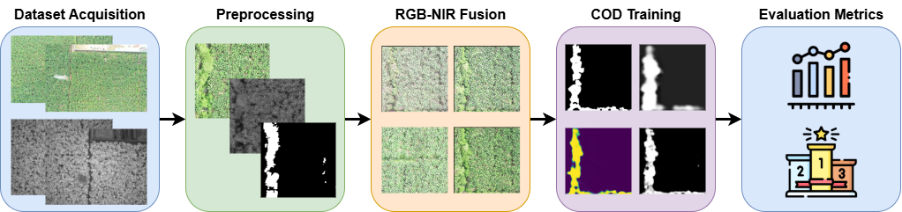

# Unveiling the Hidden: Early Detection of Invasive Vegetation in Crops with UAV Multispectral Imaging
This work presents a comprehensive framework for the early detection of camouflaged weeds in agriculture using near-infrared (NIR) imagery. The proposed methodology combines RGB-NIR fusion techniques with camouflaged object detection (COD) approaches to address the challenge of identifying weeds that blend seamlessly into their agricultural environment. Fourteen state-of-the-art (SOTA) fusion techniques are evaluated, with the top three performing methods demonstrating superior integration of multispectral information. Subsequently, nine SOTA COD techniques are trained on both RGB and RGB-NIR fused datasets to assess detection performance across different spectral configurations. Experimental results on two UAV-based case studies—(i) our in-house Weeds-Banana dataset acquired in a commercial banana plantation and (ii) the SOTA WeedsGalore dataset collected in a maize field—demonstrate that RGB–NIR fusion consistently improves segmentation accuracy over RGB-only inputs. This multispectral approach offers a promising solution for precision agriculture, enabling early detection of camouflaged weeds and reducing dependence on chemical herbicides for sustainable crop management. 

  

# Dataset
https://www.kaggle.com/datasets/hvelesaca/weedbananacod
